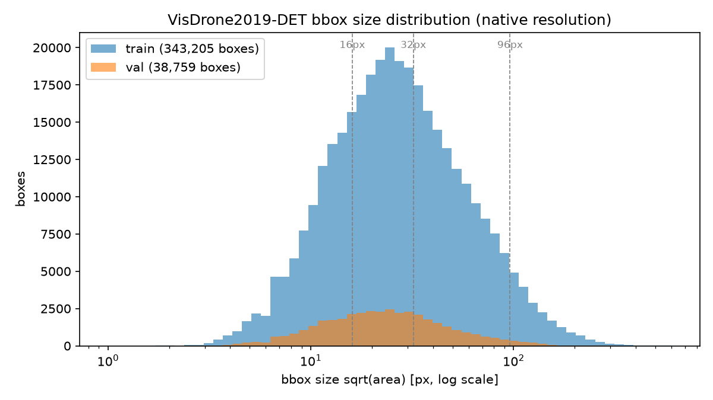
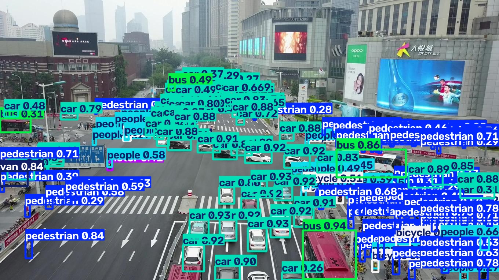
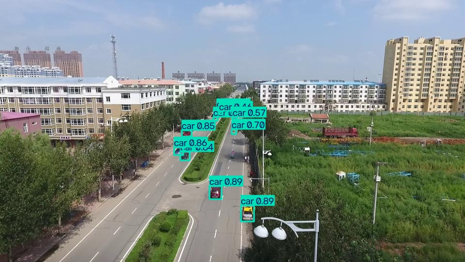
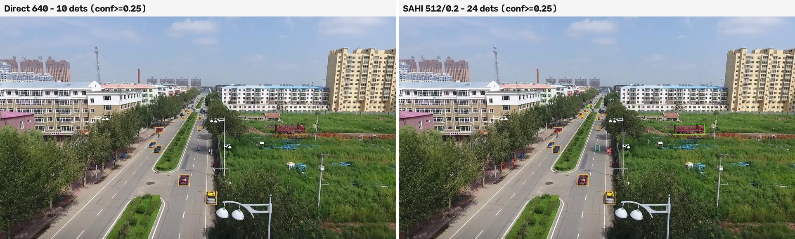
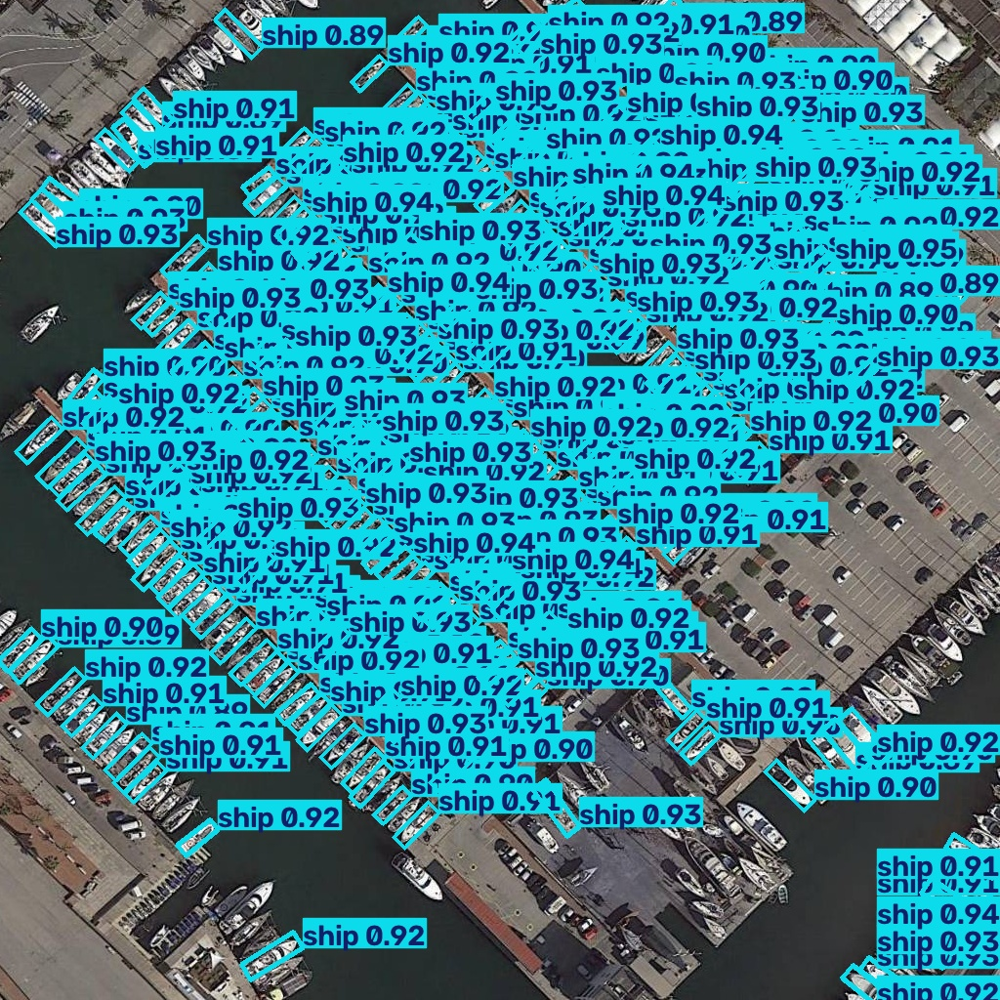
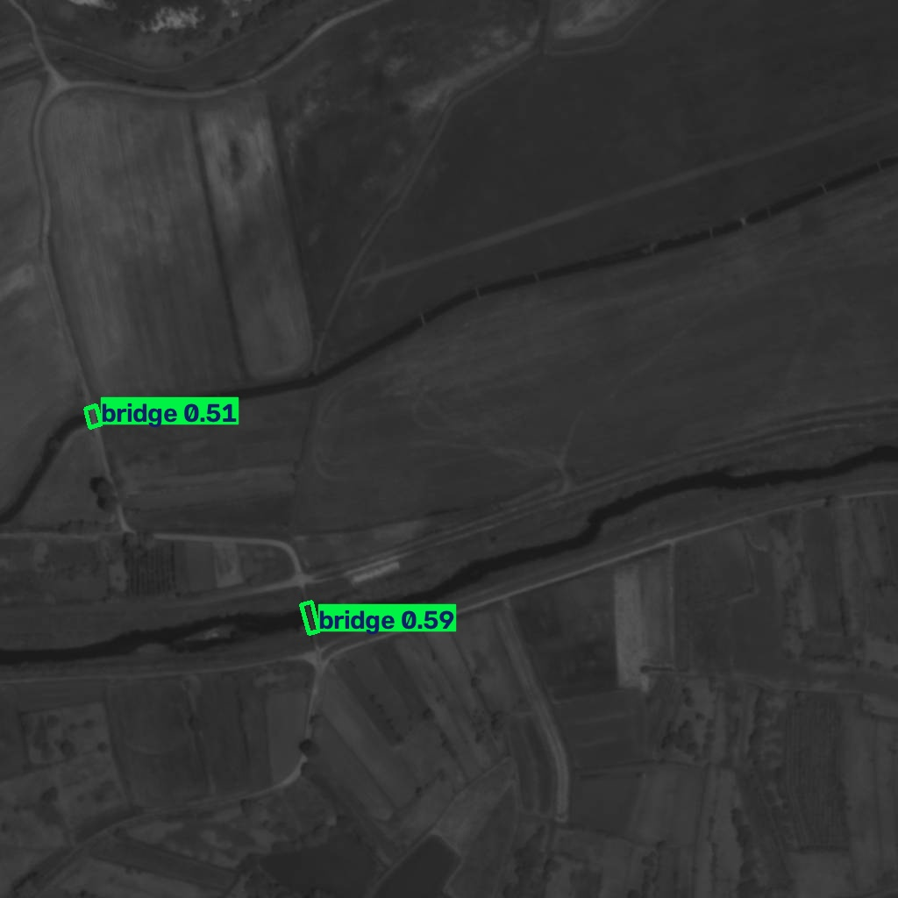

# UAV Traffic Vision — Drone-View Detection & Traffic Flow Analysis with YOLO26

Small-object detection from drone imagery using
[Ultralytics YOLO26](https://docs.ultralytics.com/models/yolo26/), trained on
[VisDrone2019-DET](https://github.com/VisDrone/VisDrone-Dataset) (10 classes:
pedestrian, people, bicycle, car, van, truck, tricycle, awning-tricycle, bus, motor),
with [SAHI](https://github.com/obss/sahi) sliced inference for dense tiny objects,
ByteTrack-based traffic flow counting, and an edge-deployment benchmark
(ONNX / TensorRT FP16).

> **Status: complete** — 640/1024 baselines evaluated, SAHI comparison, traffic
> counting, and edge deployment benchmarks done; weights and a live demo are
> published on Hugging Face (see Demo below).

## Why this matters

Taiwan's drone industry is scaling quickly on the policy side: the Executive Yuan's
「無人載具產業發展統籌型計畫」(approved Oct 2025) commits NT$44.2B through 2030 targeting
NT$40B+ in annual UAV industry output, and the Ministry of National Defense is
separately procuring on the order of tens of thousands of drones over 2026-2027. Most
of that investment — the 無人機國家隊 formed in 2022, the Chiayi AAMIC R&D center — is
concentrated on airframes and defense hardware. The perception layer (what a drone
*sees* and *understands*) is comparatively less built out, and that's the layer this
project is about.

Three application domains map directly onto the pieces built here:

- **Infrastructure inspection**: finding and localizing small objects at altitude
  (this project's core small-object detection problem, and the reason SAHI sliced
  inference is the centerpiece experiment) is the same capability needed to spot
  defects, encroachments, or hazards in inspection footage.
- **Coastal patrol**: the Ocean Affairs Council (海巡署) has operated rotary-wing
  drones for maritime patrol since 2018, but public oversight bodies have
  documented real reliability problems along the way — a 2022 Control Yuan review
  and legislative reports cite high failure rates and equipment idled after
  failing civil aviation type certification. A second-generation procurement is
  underway as of January 2026. Detecting and tracking moving objects over
  water from a patrolling airframe is a close analog to this project's
  detect-track-count pipeline — and "does the perception stack actually work
  reliably" is exactly the kind of question a program with this track record
  needs answered.
- **Smart traffic management**: the traffic flow counting module here (YOLO26 +
  ByteTrack + a virtual counting line) is a directly reusable building block for
  drone- or fixed-camera-based traffic monitoring, an area Taiwanese city
  governments' smart-city programs are actively funding.

The common thread: small, dense, aerial-viewpoint objects; inference fast enough to
matter in real time; and a credible path to onboard (edge) deployment. That's why
this project's three technical legs — SAHI for small-object accuracy, tracking-based
counting, and the ONNX/TensorRT edge benchmark — were built together rather than as
three unrelated demos.

## Dataset

VisDrone2019-DET — 6,471 train / 548 val images, 10 classes, auto-downloaded and
converted by ultralytics' built-in `VisDrone.yaml`. Key findings from the EDA
([full report](reports/dataset_stats.md)):

- **Tiny objects dominate**: 60.5% of train boxes (68.5% of val) are smaller than
  32×32 px at native resolution — the core motivation for higher input resolution
  and SAHI sliced inference.
- **Dense scenes**: 53 objects per image on average (train), up to 902. Only
  0.2–0.5% of images exceed the 300-detection cap of YOLO26's end-to-end head,
  so the cap matters far less than object size does.
- **Heavy class imbalance**: 144.9k car instances vs 3.2k awning-tricycle.



## Results

Three settings, one evaluation protocol (pycocotools, conf=0.01, maxDets=500 — dense
scenes overflow COCO's default 100), so every number below is directly comparable.
yolo26s trained 97 epochs at imgsz=640 (early-stopped, patience=20, mAP50-95 0.220 at
convergence) and a second run 74 epochs at imgsz=1024 (early-stopped, mAP50-95 0.293 —
epoch 54 was the actual best checkpoint). Per-class tables and figures:
[reports/evaluation.md](reports/evaluation.md) (640),
[reports/evaluation_1024.md](reports/evaluation_1024.md) (1024),
[reports/sahi_comparison.md](reports/sahi_comparison.md).

| Setting | AP50 | AP@[.5:.95] | AP tiny (<16px) | AP small | AP medium | AP large | ms/img (4090) |
|---------|------|-------------|------------------|---------|-----------|----------|----------------|
| yolo26s @ 640, direct | 0.380 | 0.222 | 0.075 | 0.184 | 0.316 | **0.480** | 10 |
| yolo26s @ 1024, direct | **0.480** | **0.291** | 0.119 | **0.261** | **0.403** | 0.463 | 10 |
| yolo26s @ 640 + SAHI 512/0.2 | 0.465 | 0.269 | **0.134** | 0.248 | 0.349 | 0.455 | 107 |

Batch=1 latency on the RTX 4090 is essentially unchanged from 640 to 1024 (10.2 vs 10.0
ms/img) — at this model scale the GPU isn't compute-saturated at either resolution, so
fixed overhead (preprocessing, kernel launch) dominates over the ~2.6x difference in
pixel count. This makes the 1024 checkpoint a strictly better choice than 640 on this
hardware: higher accuracy at no latency cost. (This may not hold on smaller/edge GPUs —
see Edge deployment below.)

Two independent evaluation paths agree closely at 640 (ultralytics `model.val()`:
mAP50-95 0.220; the pycocotools pipeline above: 0.222) and at 1024 (0.293 vs 0.291),
cross-validating the tooling.

### Small-object breakdown: three techniques, no single winner

No approach dominates every bucket — each wins where its mechanism actually applies:

- **SAHI wins the smallest objects** (AP tiny 0.134 vs 1024's 0.119 vs 640's 0.075):
  slicing shows a tile at closer to native resolution than any single resize can,
  even a resize to 1024.
- **Higher training resolution wins small-to-medium objects** (AP small 0.261, AP
  medium 0.403 — both the best of the three) and does it in a single forward pass,
  no slicing overhead.
- **Plain 640 direct is (barely) best on large objects** (0.480) — both SAHI's tiling
  and 1024's downsampling introduce small costs there that resolution/slicing don't
  pay back.

In short: resolution is the more efficient lever for the bulk of the size distribution,
but SAHI still earns its 10x latency cost specifically on the smallest, hardest objects
that resolution alone doesn't fully recover.

| Dense scene (187 detections) | Small-object-heavy scene (10 detections) |
|---|---|
|  |  |

More examples in [reports/evaluation.md](reports/evaluation.md).

## SAHI sliced inference

[SAHI](https://github.com/obss/sahi) slices each image into overlapping tiles, runs the
detector per tile, and merges the results — so a 15px pedestrian is seen at ~2x scale
instead of shrinking into a few pixels at imgsz=640. A 3-config sweep (512/640/800 tile
sizes, 100-image subset) picked **512×512 tiles, 0.2 overlap** by tiny-bucket AP. Full
report: [reports/sahi_comparison.md](reports/sahi_comparison.md).

On the full val set, SAHI vs direct inference:

- **AP50 +22% relative** (0.380 → 0.465), overall AP +21% (0.222 → 0.269)
- **Tiny-object AP +79% relative** (0.075 → 0.134), tiny-object recall AR@500 +75%
  (0.181 → 0.316) — the buckets that dominate this dataset
- Honest trade-offs: **10.2x per-image latency** (10 → 107 ms on RTX 4090), and large-object
  AP dips slightly (0.480 → 0.455) since tiling can fragment big objects — the built-in
  full-image pass (`perform_standard_pred=True`) recovers most but not all of it

Slicing also side-steps YOLO26's end-to-end 300-detections-per-pass budget: at evaluation
confidence (0.01), **323 of 548 val images saturate the cap in direct mode**, while SAHI's
per-tile budget let the densest scene emit 966 detections. (At practical confidence
thresholds like 0.25 the cap binds far less often — but for dense aerial scenes it is a
real ceiling on recall.)



*Same image, same model, same confidence threshold — direct 640 finds 10 objects, SAHI
finds 24 (distant vehicles, roadside pedestrians, the truck on the right).*

## Traffic flow counting

Detection (`yolo26s_visdrone_640`, imgsz=1280) + ByteTrack + a virtual counting line
on a near-stationary drone hover over a busy intersection
([VisDrone2019-MOT val](https://huggingface.co/datasets/Voxel51/visdrone-mot), CC BY-SA).
The counter uses proper segment-segment intersection (not an infinite-line side flip,
which would double-count a vehicle idling near the line) and counts each track ID once;
only vehicle classes are counted, pedestrians/bicycles are detected and drawn but
excluded. Full writeup: [reports/traffic_analysis.md](reports/traffic_analysis.md).


| direction | car | van | motor | total |
|-----------|-----|-----|-------|-------|
| dir_pos | 21 | 0 | 2 | 23 |
| dir_neg | 7 | 2 | 2 | 11 |
| **total** | 28 | 2 | 4 | **34** |

Full stats: [reports/traffic/stats.json](reports/traffic/stats.json).

## Edge deployment

**All numbers below were measured on this desktop (RTX 4090 / host CPU), not on a
Jetson** — there is no onboard hardware available for this project. Treat the
Jetson discussion as an informed migration plan, not a benchmark.

### Benchmark (batch=1, imgsz=640, 100 timed runs)

| backend | mean (ms) | p50 (ms) | p95 (ms) | FPS |
|---------|-----------|----------|----------|-----|
| PyTorch .pt (4090) | 13.41 | 13.35 | 14.40 | 74.6 |
| ONNX (CPU) | 48.95 | 49.77 | 53.05 | 20.4 |
| TensorRT FP16 (4090) | **11.52** | 11.34 | 14.11 | **86.8** |

TensorRT FP16 beats plain PyTorch by ~14% and CPU ONNX by ~4.2x on this GPU. Full
numbers: [reports/edge_benchmark.md](reports/edge_benchmark.md).

### Why YOLO26's NMS-free head matters here

Exporting confirmed it directly: the ONNX/TensorRT graph's output tensor is a fixed
`(1, 300, 6)` — no NMS op in the graph at all (`end2end=True` is YOLO26's default for
export-friendly formats). For onboard deployment this removes real pain points:

- **No NMS plugin dependency** — TensorRT NMS plugins are a recurring source of
  version-compatibility breakage across TensorRT releases; a fixed-shape output
  needs none.
- **Deterministic latency** — a classic NMS box count varies with scene content
  (more candidate boxes in a dense frame → slower NMS); a flight controller loop
  budgeting a fixed time slice per frame benefits from output shape (and cost)
  not depending on scene content.
- **Simpler INT8 quantization** — NMS's sort/threshold ops don't quantize cleanly;
  a plain conv/concat graph is a much easier calibration target if a future INT8
  pass is needed for a lower-power module.
- **Trade-off, stated honestly**: fixed at 300 detections/frame — our EDA showed
  this saturates on only ~0.5% of VisDrone val images at realistic confidence, so
  it's a non-issue for VisDrone-scale scenes, but a truly crowded scene (a stadium,
  a parking lot from very low altitude) could hit it.

### Path to a Jetson-class onboard computer

1. **The `.engine` file here will not run on a Jetson.** TensorRT engines are
   compiled for a specific GPU architecture (this one targets Ada Lovelace,
   compute capability 8.9); a Jetson Orin (Ampere, 8.7) needs its own build. The
   ONNX file is portable and is the actual deployment artifact — `trtexec` or
   `model.export(format="engine")` re-run **on the Jetson itself**.
2. **Expected throughput**: an AGX Orin's Tensor Cores deliver roughly a tenth of
   an RTX 4090's dense FP16 throughput. Scaling the 11.5ms/frame TensorRT number
   this naively (it won't hold exactly — Orin has a very different memory
   hierarchy and the model is latency-, not just throughput-bound at batch=1)
   suggests **a low-tens-of-ms range, plausibly 20-40 FPS** on a mid-tier Orin
   module — worth validating on real hardware before committing to a flight
   control loop rate, not assuming.
3. **Shared memory, not discrete VRAM**: Jetson modules use unified CPU/GPU
   memory (8-64GB depending on SKU) shared with the rest of the flight stack
   (state estimation, path planning) — the training-time VRAM headroom
   discussions earlier in this project (a 24-80GB discrete GPU) don't transfer;
   the real constraint on an 8GB Orin Nano is closer to the CPU ONNX benchmark's
   memory footprint than the desktop GPU's.
4. **Power budget**: onboard inference draws from the same battery as flight
   time. A 15-25W Orin module inference load is a real trade against flight
   duration, unlike a desktop's wall power — this is the actual reason to
   default to the smaller `yolo26n`/`yolo26s` scales rather than `l`/`x` for an
   airborne system, independent of raw accuracy.

## Bonus: a different annotation paradigm (DOTA-v1.0, oriented bounding boxes)

Optional Phase 3 add-on, not a second full pipeline — same aerial-imagery domain,
showing that the YOLO26 workflow above adapts to a different label format:
**oriented bounding boxes (OBB)** instead of VisDrone's axis-aligned ones, trained
on [DOTA-v1.0](https://captain-whu.github.io/DOTA/index.html) (15 classes: planes,
ships, vehicles, courts, and other aerial infrastructure).

**Why OBB here**: DOTA's raw imagery runs 421–13,383px per side (median ~2,100px —
[measured EDA](reports/dota_stats.md)), far too large for direct YOLO input, so
images are tiled into overlapping 1024×1024 crops with ultralytics'
[`split_dota`](https://docs.ultralytics.com/datasets/obb/) utility (15,749 train /
5,297 val tiles from 1,869 raw images). And unlike VisDrone's mostly-overhead
traffic cameras, DOTA objects are genuinely rotated: only 31–45% of boxes fall
within 5° of axis-aligned — the rest (ships in harbors, planes on tarmac, bridges
crossing at an angle) need a rotated box to fit tightly at all.

### Results (`yolo26s-obb`, imgsz=1024, val split — 5,297 tiles)

| metric | value |
|--------|-------|
| mAP50 | 0.753 |
| mAP50-95 | 0.604 |
| Precision | 0.798 |
| Recall | 0.706 |

Strongest classes: tennis court (AP50-95 0.903), plane (0.864). Weakest: bridge
(0.343 — DOTA's most extreme aspect-ratio class) and helicopter (0.403 — only 122
val instances). Full per-class table: [`reports/dota_obb_evaluation.md`](reports/dota_obb_evaluation.md).

**An honest training note**: two independent full training runs (patience=20,
stopped at epoch 21; a clean restart with patience=30, stopped at epoch 31) both
converged to the identical result — fitness peaked at epoch 1 and was never beaten
by further fine-tuning in either run. `yolo26s-obb.pt`'s pretrained checkpoint is
already trained on DOTAv1 by Ultralytics, so epoch 1 here largely reflects that
starting point; this project's own fine-tuning (single-scale, default
augmentation, 1,869 source images) didn't find further headroom within either
patience budget. The number above is real, validated, and reproducible on this
machine — not read off an in-progress run.

### Example detections

| Dense scene (marina) | Elongated scene (bridge) |
|---|---|
|  |  |

The marina tile has 503 ground-truth ships — the model finds 300 of them, capped
by YOLO26's end-to-end head, the same 300-detection ceiling flagged in this
project's original VisDrone EDA showing up again in a completely different
dataset. Notice the rotated boxes tracking each boat's actual heading (an
axis-aligned box would need to be visibly larger to cover a diagonally-moored
boat), and the bridge's box following the river crossing at its true angle
rather than a loose axis-aligned rectangle.

Training notebook: [`notebooks/train_yolo26obb_dota_colab.ipynb`](notebooks/train_yolo26obb_dota_colab.ipynb).
Weights are not published to Hugging Face (this is a supplementary demonstration,
not a maintained model release) — reproduce via the notebook if needed.

DOTA-v1.0 (Wuhan University AISKYEYE team) is released for **academic use only**;
commercial use is prohibited by the dataset license.

## Demo

**Live demo**: [huggingface.co/spaces/betty0/uav-traffic-vision](https://huggingface.co/spaces/betty0/uav-traffic-vision)
— image detection, runs on free CPU hardware (ONNX), with an opt-in SAHI toggle
(off by default — meaningfully slower on CPU). Source: [`app/`](app/). Video
tracking/counting is shown via the GIF above rather than a live demo (SAHI-on-CPU
and multi-frame tracking together would be too slow for a free Space).

Model weights + card: [huggingface.co/betty0/uav-traffic-vision](https://huggingface.co/betty0/uav-traffic-vision).

## Reproduce

Prerequisites: [uv](https://docs.astral.sh/uv/). The VisDrone2019-DET dataset
(~2.3 GB) is downloaded automatically by ultralytics on first use.

```bash
# 1. install dependencies
uv sync

# 2. dataset EDA (triggers the VisDrone auto-download on first run)
uv run python scripts/dataset_stats.py

# 3. local smoke test (small subset, 1 epoch, sanity check)
uv run python scripts/make_subset.py

# 4. train — open notebooks/train_yolo26_visdrone_colab.ipynb in Google Colab (Runtime -> Run all)

# 5. evaluate a trained checkpoint (overall + per-class + small-object breakdown)
uv run python scripts/evaluate.py --weights weights/yolo26s_visdrone_640.pt

# 6. direct vs SAHI comparison (sweep + full val + side-by-side figures)
uv run python scripts/sahi_compare.py --weights weights/yolo26s_visdrone_640.pt

# 7. traffic counting (fetches VisDrone-MOT val, ~1.7 GB, on first run)
uv run python scripts/fetch_visdrone_mot.py
uv run python scripts/traffic_count.py --video ~/datasets/VisDrone-MOT-val/uav0000137_00458_v.mp4 \
    --line 0.02,0.32,0.97,0.22 --gif reports/figures/traffic_demo.gif --gif-len 9

# 8. export ONNX + TensorRT FP16, benchmark CPU vs GPU
uv run python scripts/export_benchmark.py --weights weights/yolo26s_visdrone_640.pt
```

## License & dataset attribution

Code is MIT licensed. The [VisDrone2019 dataset](https://github.com/VisDrone/VisDrone-Dataset)
(AISKYEYE team, Tianjin University) is available for **academic / research use only**;
this project uses it for non-commercial portfolio research and does not redistribute
the data. Model weights trained on VisDrone inherit that restriction. The traffic-counting
demo uses a clip from [VisDrone2019-MOT val](https://huggingface.co/datasets/Voxel51/visdrone-mot)
(same AISKYEYE source, mirrored under **CC BY-SA**).
