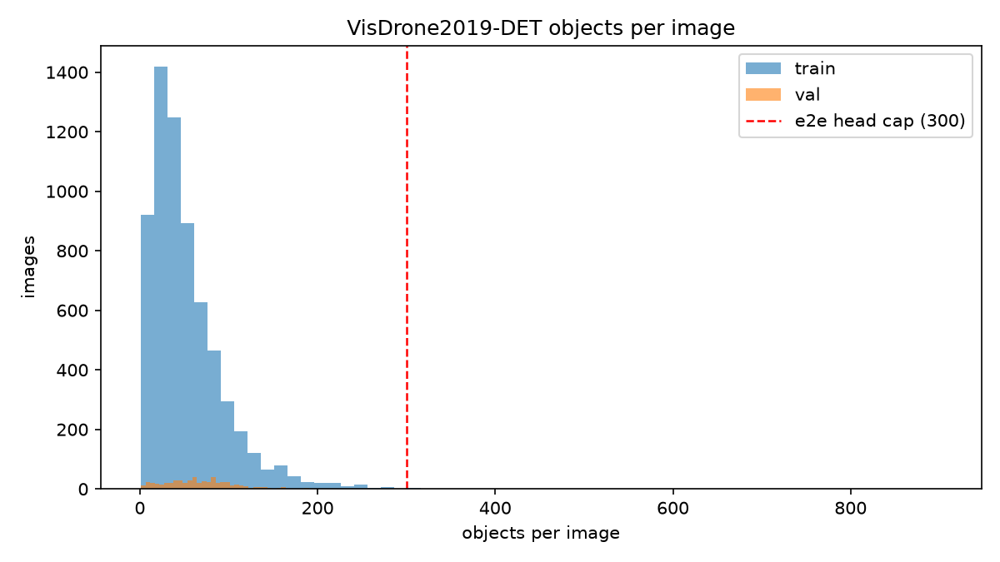

# VisDrone2019-DET dataset statistics

Generated by `scripts/dataset_stats.py`; all numbers measured from the
converted YOLO labels at native image resolution.

## Split overview

| split | images | instances | background images | mean obj/img | median | p95 | max |
|-------|--------|-----------|-------------------|--------------|--------|-----|-----|
| train | 6,471 | 343,205 | 0 | 53.0 | 42 | 132 | 902 |
| val | 548 | 38,759 | 0 | 70.7 | 65 | 157 | 317 |

## Images above the end-to-end detection cap (300)

- **train**: 12 images (0.2%) have more than 300 objects; a full-image detector capped at 300 can miss at most 1,379 ground-truth objects (0.40% of instances).
- **val**: 3 images (0.5%) have more than 300 objects; a full-image detector capped at 300 can miss at most 34 ground-truth objects (0.09% of instances).

## Instances per class

| id | class | train | val |
|----|-------|-------|-----|
| 0 | pedestrian | 79,337 | 8,844 |
| 1 | people | 27,059 | 5,125 |
| 2 | bicycle | 10,480 | 1,287 |
| 3 | car | 144,867 | 14,064 |
| 4 | van | 24,956 | 1,975 |
| 5 | truck | 12,875 | 750 |
| 6 | tricycle | 4,812 | 1,045 |
| 7 | awning-tricycle | 3,246 | 532 |
| 8 | bus | 5,926 | 251 |
| 9 | motor | 29,647 | 4,886 |

## Bbox area buckets (native resolution)

| bucket | train boxes | train % | val boxes | val % |
|--------|-------------|---------|-----------|-------|
| tiny (<16^2) | 89,264 | 26.0% | 11,955 | 30.8% |
| small (16^2-32^2) | 118,341 | 34.5% | 14,631 | 37.7% |
| medium (32^2-96^2) | 116,620 | 34.0% | 11,105 | 28.7% |
| large (>96^2) | 18,980 | 5.5% | 1,068 | 2.8% |

## Image resolutions

- **train** (11 distinct): 1400x1050 (2498), 1400x788 (1299), 2000x1500 (772), 1360x765 (743), 1916x1078 (537)
- **val** (3 distinct): 1360x765 (408), 960x540 (121), 1920x1080 (19)

