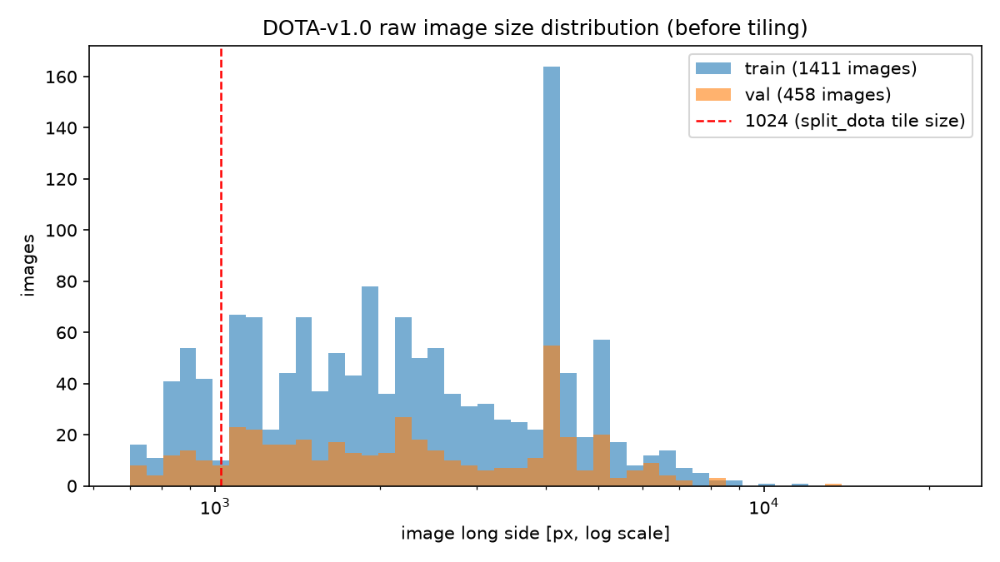
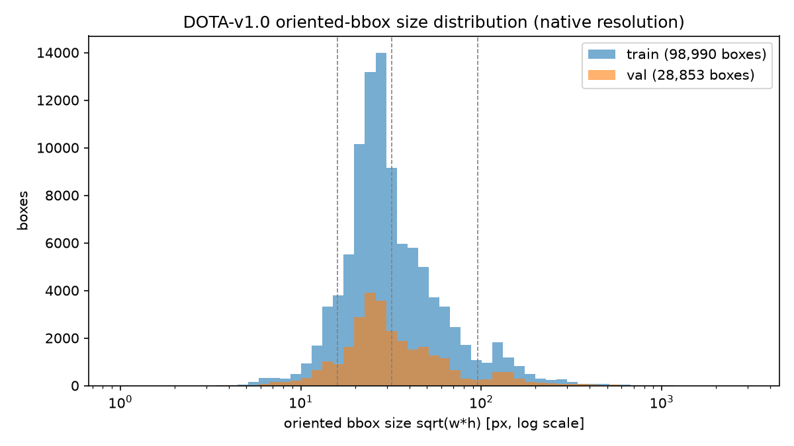
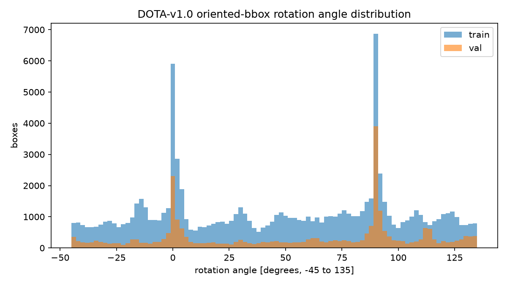
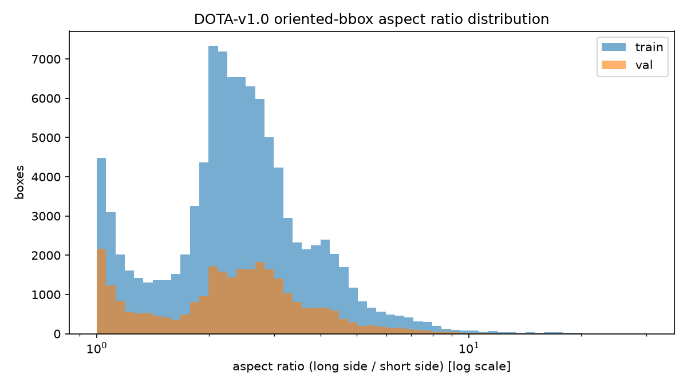

# DOTA-v1.0 (OBB) dataset statistics

Generated by `scripts/dota_stats.py`; all numbers measured from the raw
(pre-`split_dota`-tiling) YOLO-OBB labels at native image resolution.
Test split is excluded (unlabeled).

## Split overview

| split | images | instances | background images | mean obj/img | median | p95 | max |
|-------|--------|-----------|-------------------|--------------|--------|-----|-----|
| train | 1,411 | 98,990 | 2 | 70.2 | 23 | 309 | 1939 |
| val | 458 | 28,853 | 2 | 63.0 | 22 | 285 | 1401 |

## Images above the end-to-end detection cap (300)

Measured on raw (untiled) images for context; the model never actually sees a
full raw image at train/inference time (`split_dota` tiles it to 1024x1024 first),
so this cap applies per-tile, not per-scene -- see the tiling section below.

- **train**: 74 images (5.2%) have more than 300 objects; capping a whole-scene detector at 300 can miss at most 18,799 ground-truth objects (18.99% of instances).
- **val**: 20 images (4.4%) have more than 300 objects; capping a whole-scene detector at 300 can miss at most 4,776 ground-truth objects (16.55% of instances).

## Instances per class

| id | class | train | val |
|----|-------|-------|-----|
| 0 | plane | 8,055 | 2,531 |
| 1 | ship | 28,068 | 8,960 |
| 2 | storage tank | 5,029 | 2,888 |
| 3 | baseball diamond | 415 | 214 |
| 4 | tennis court | 2,367 | 760 |
| 5 | basketball court | 515 | 132 |
| 6 | ground track field | 325 | 144 |
| 7 | harbor | 5,983 | 2,090 |
| 8 | bridge | 2,047 | 464 |
| 9 | large vehicle | 16,969 | 4,387 |
| 10 | small vehicle | 26,126 | 5,438 |
| 11 | helicopter | 630 | 73 |
| 12 | roundabout | 399 | 179 |
| 13 | soccer ball field | 326 | 153 |
| 14 | swimming pool | 1,736 | 440 |

## Oriented-bbox area buckets (native resolution, same cutoffs as the VisDrone EDA)

| bucket | train boxes | train % | val boxes | val % |
|--------|-------------|---------|-----------|-------|
| tiny (<16^2) | 9,178 | 9.3% | 2,990 | 10.4% |
| small (16^2-32^2) | 50,672 | 51.2% | 13,908 | 48.2% |
| medium (32^2-96^2) | 32,151 | 32.5% | 9,434 | 32.7% |
| large (>96^2) | 6,989 | 7.1% | 2,521 | 8.7% |

## Rotation angle

- **train**: 31.1% of boxes fall within 5 degrees of an axis-aligned orientation (0/90 degrees); the rest are genuinely rotated, which is the core motivation for OBB over axis-aligned boxes on this dataset.
- **val**: 45.2% of boxes fall within 5 degrees of an axis-aligned orientation (0/90 degrees); the rest are genuinely rotated, which is the core motivation for OBB over axis-aligned boxes on this dataset.

## Aspect ratio (long side / short side)

- **train**: median 2.39, p95 5.05, max 68.9
- **val**: median 2.40, p95 5.18, max 65.5

## Image resolutions (why tiling is mandatory)

- **train**: long side ranges 421-12029px (median 2098px); 85.8% of images exceed 1024px, 15.0% exceed 4000px.
- **val**: long side ranges 511-13383px (median 2143px); 87.3% of images exceed 1024px, 17.0% exceed 4000px.

