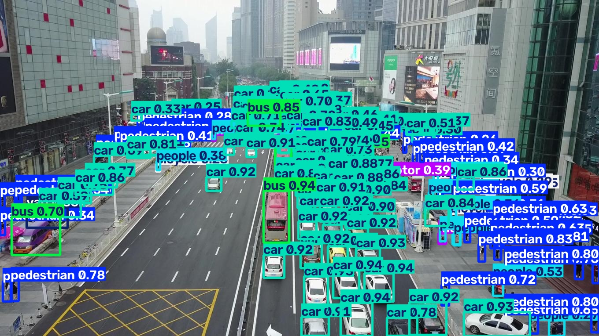
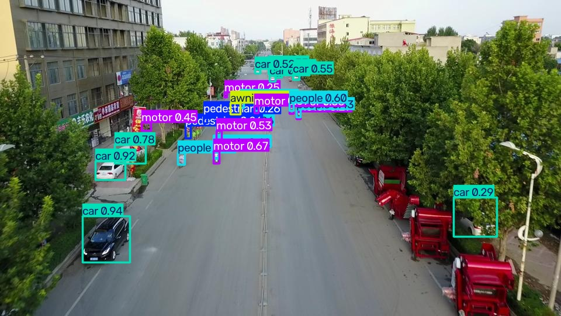

# Evaluation: yolo26s @ imgsz=640 on VisDrone2019-DET val

Weights: `weights/yolo26s_visdrone_640.pt`. All numbers from actual script execution.

## Overall (ultralytics `model.val()`)

- mAP50: **0.3794**
- mAP50-95: **0.2200**
- mean precision: 0.5136, mean recall: 0.3938

## Per-class

| class | P | R | AP50 | AP50-95 |
|-------|---|---|------|---------|
| pedestrian | 0.545 | 0.456 | 0.449 | 0.202 |
| people | 0.493 | 0.355 | 0.344 | 0.131 |
| bicycle | 0.299 | 0.161 | 0.128 | 0.053 |
| car | 0.714 | 0.789 | 0.782 | 0.537 |
| van | 0.541 | 0.420 | 0.407 | 0.282 |
| truck | 0.562 | 0.303 | 0.304 | 0.199 |
| tricycle | 0.393 | 0.284 | 0.248 | 0.131 |
| awning-tricycle | 0.335 | 0.160 | 0.131 | 0.084 |
| bus | 0.692 | 0.534 | 0.536 | 0.381 |
| motor | 0.560 | 0.477 | 0.464 | 0.201 |

## Small-object analysis (COCO-style area buckets)

Independent COCO-format evaluation (pycocotools) over the same val set and predictions, with an extra **tiny** bucket (<16px side) split out from COCO's standard **small** (16-32px side), matching the EDA bucketing in `reports/dataset_stats.md`.

| bucket | AP@[.5:.95] | AR@100 |
|--------|-------------|--------|
| all | 0.223 | 0.354 |
| tiny | 0.075 | 0.184 |
| small | 0.184 | 0.333 |
| medium | 0.318 | 0.462 |
| large | 0.480 | 0.595 |

## Representative predictions

**Dense scenes:**

**Small-object-heavy scenes:**

