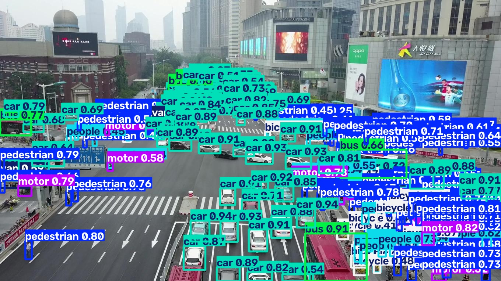
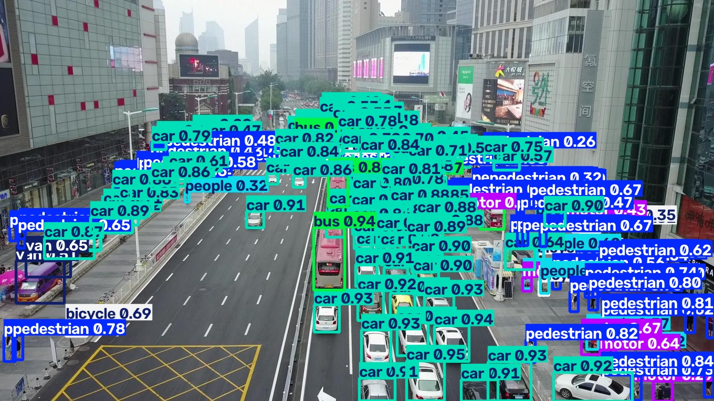
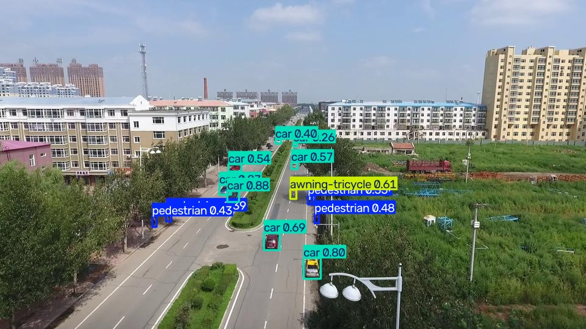
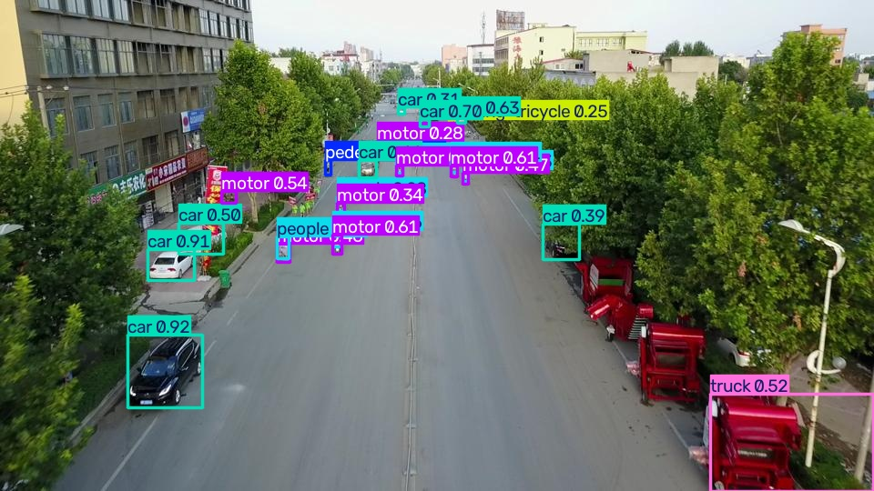

# Evaluation: yolo26s @ imgsz=1024 on VisDrone2019-DET val

Weights: `weights/yolo26s_visdrone_1024.pt`. All numbers from actual script execution.

## Overall (ultralytics `model.val()`)

- mAP50: **0.4839**
- mAP50-95: **0.2931**
- mean precision: 0.6072, mean recall: 0.4840

## Per-class

| class | P | R | AP50 | AP50-95 |
|-------|---|---|------|---------|
| pedestrian | 0.653 | 0.578 | 0.601 | 0.292 |
| people | 0.646 | 0.414 | 0.449 | 0.182 |
| bicycle | 0.438 | 0.270 | 0.268 | 0.124 |
| car | 0.810 | 0.823 | 0.845 | 0.605 |
| van | 0.542 | 0.553 | 0.512 | 0.369 |
| truck | 0.626 | 0.408 | 0.421 | 0.290 |
| tricycle | 0.527 | 0.384 | 0.353 | 0.199 |
| awning-tricycle | 0.400 | 0.220 | 0.167 | 0.107 |
| bus | 0.807 | 0.606 | 0.650 | 0.486 |
| motor | 0.622 | 0.585 | 0.575 | 0.276 |

## Small-object analysis (COCO-style area buckets)

Independent COCO-format evaluation (pycocotools) over the same val set and predictions, with an extra **tiny** bucket (<16px side) split out from COCO's standard **small** (16-32px side), matching the EDA bucketing in `reports/dataset_stats.md`.

| bucket | AP@[.5:.95] | AR@100 |
|--------|-------------|--------|
| all | 0.290 | 0.446 |
| tiny | 0.119 | 0.274 |
| small | 0.260 | 0.426 |
| medium | 0.403 | 0.562 |
| large | 0.463 | 0.578 |

## Representative predictions

**Dense scenes:**

**Small-object-heavy scenes:**

