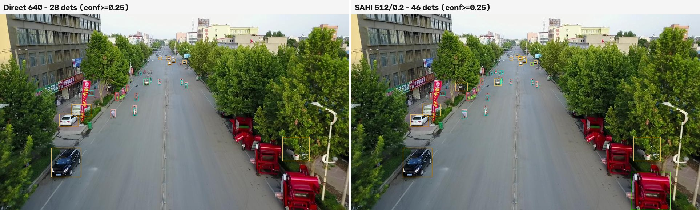
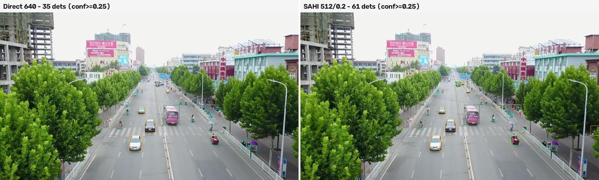

# Direct vs SAHI sliced inference (yolo26s @ 640, VisDrone val)

Protocol: identical for both modes — conf=0.01, pycocotools with maxDets=[10, 100, 500] (dense scenes need >100), custom tiny(<16px)/small/medium/large buckets. SAHI: GREEDYNMM/IOS/0.5 merge, standard full-image pass included (`perform_standard_pred=True`). Latency: per-image wall time on RTX 4090, batch=1. All numbers from actual runs.

## Parameter sweep (100-image subset, seed 42)

| mode | AP50 | AP | AP tiny | AP small | AP medium | AP large | AR@500 | AR@500 tiny | ms/img |
|------|------|----|---------|----------|-----------|----------|--------|-------------|--------|
| SAHI 640/0.2 | 0.450 | 0.258 | 0.125 | 0.236 | 0.338 | 0.556 | 0.436 | 0.284 | 82 |
| SAHI 512/0.2 | 0.471 | 0.269 | 0.139 | 0.255 | 0.342 | 0.590 | 0.459 | 0.295 | 109 |
| SAHI 800/0.2 | 0.466 | 0.270 | 0.127 | 0.237 | 0.365 | 0.574 | 0.426 | 0.262 | 60 |

Chosen by tiny-bucket AP: **slice 512/0.2**.

## Full val (548 images)

| mode | AP50 | AP | AP tiny | AP small | AP medium | AP large | AR@500 | AR@500 tiny | ms/img |
|------|------|----|---------|----------|-----------|----------|--------|-------------|--------|
| Direct 640 | 0.380 | 0.222 | 0.075 | 0.184 | 0.316 | 0.480 | 0.348 | 0.181 | 10 |
| SAHI 512/0.2 | 0.465 | 0.269 | 0.134 | 0.248 | 0.349 | 0.455 | 0.455 | 0.316 | 107 |

SAHI vs direct: overall AP +0.046, tiny-bucket AP +0.059 (0.075 → 0.134), tiny-bucket AR@500 +0.135, at 10.2x the per-image latency.

## Detection-count / 300-cap analysis

YOLO26's end-to-end head emits at most 300 detections per forward pass.

| mode | mean dets/img | max dets/img | images at cap |
|------|---------------|--------------|----------------|
| Direct 640 | 240 | 300 | 323 |
| SAHI 512/0.2 | 395 | 966 | n/a (per-slice cap) |

323 of 548 direct-mode images saturate the 300-detection cap (at conf≥0.01); slicing raises the effective per-image budget to 300×(slices+1), and SAHI's densest output here reached 966 detections.

## Side-by-side examples (small-object-heavy scenes)

